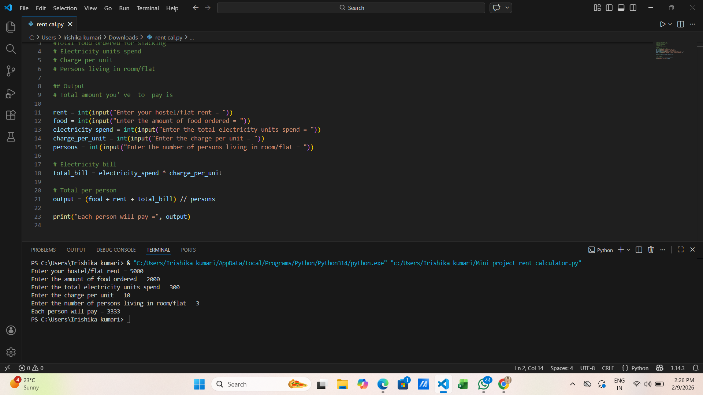

# Rent Calculator (Python Mini Project)

This project calculates per person living expenses by adding:

- Hostel/Flat Rent
- Food Expenses
- Electricity Bill

Then divides total cost among persons.

## Features
✔ User input system  
✔ Electricity auto calculation  
✔ Cost split per person  

## Technology Used
Python

## Author
Priyanka Kumari
## Project Output

